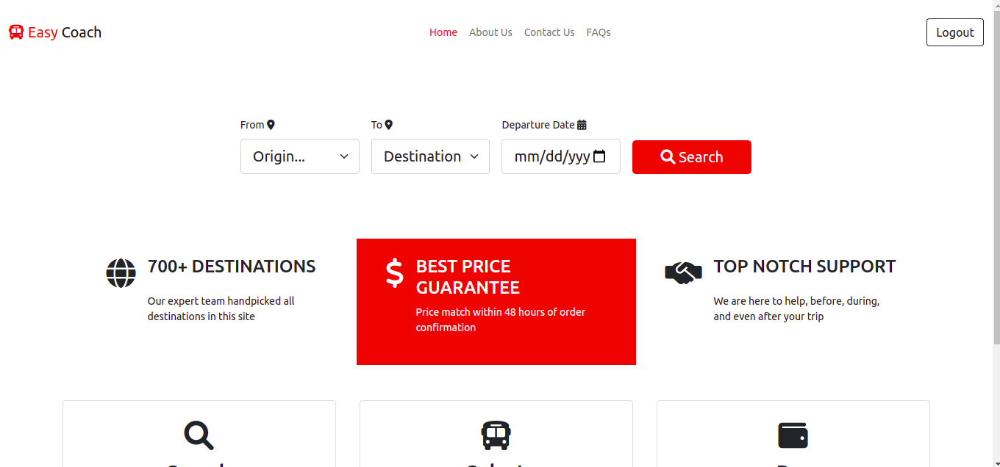

# Tusafiri Project

This is a bus booking and ticketing system that allows people to book buses to various destinations from the comfort of their home.




## Running

Make sure you have Docker and Docker-compose installed on your system

### Development

```bash
docker-compose -f docker-compose.dev.yml up --build
```

OR

```bash
docker-compose -f docker-compose.dev.yml up
```

### Production

Then you can run the commands below.

```bash
docker-compose up --build
```

OR

```bash
docker-compose up
```

If you wish to use a remote hosted database instance then you need to create a ```.env.local``` file at the root of the project. Inside the ```.env.local``` file add the ```DB_URI``` environment variable like so:

```text
DB_URI={database URI string here...}
```

Then start with the following commands:

```bash
docker-compose --env-file .env.local ...
```

Note by default docker compose will use .env file to inject environment variables in this case we add ```--env-file``` which specify an alternate environment file.

Enjoy :D
